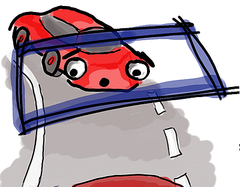

# Self Driving Car Engineer Project 5 - Vehicle Detection & Tracking
## Benjamin Söllner, 25 Jun 2017

---



---

The goals / steps of this project are the following:

* Perform a Histogram of Oriented Gradients (HOG) feature extraction on a labeled training set of images and train a classifier Linear SVM classifier
* Optionally, you can also apply a color transform and append binned color features, as well as histograms of color, to your HOG feature vector.
* Note: for those first two steps don't forget to normalize your features and randomize a selection for training and testing.
* Implement a sliding-window technique and use your trained classifier to search for vehicles in images.
* Run your pipeline on a video stream (start with the test_video.mp4 and later implement on full project_video.mp4) and create a heat map of recurring detections frame by frame to reject outliers and follow detected vehicles.
* Estimate a bounding box for vehicles detected.

## Files Submitted

My project includes the following files:

* [``writeup_report.md``](writeup_report.md) / [``.html``](writeup_report.html): the writeup of this project including the showcase images (you are reading it)
* [``project_video_output.mp4``](project_video_output.mp4): the output video with bounding boxes for cars identified
* [``project_video_output_debug.mp4``](project_video_output_debug.mp4): the output video with diagnostic information
* [``test_video_output.mp4``](project_video_output.mp4): the short test video with bounding boxes for cars identified
* [``test_video_output_debug.mp4``](project_video_output_debug.mp4): the short test video with diagnostic information
* [``src/model.py``](src/model.py): the code / algorithm to perform vehicle detection / tracking
* [``src/tests.py``](src/tests.py): boilerplate functions to test the model code and view the output with matplotlib
* [``src/hyperparams.py``](src/hyperparams.py): the hyperparameters for the algorithm
* [``CarND 05 Vehicle Detection and Tracking.ipynb``](CarND%2005%20Vehicle%20Detection%20and%20Tracking.ipynb) / [``.html```](CarND%2005%20Vehicle%20Detection%20and%20Tracking.html): a (rendered) iPython notebook that contains the output of all tests
* [``tester.py``](tester.py): a command line tool to test the code without python notebooks
