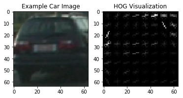
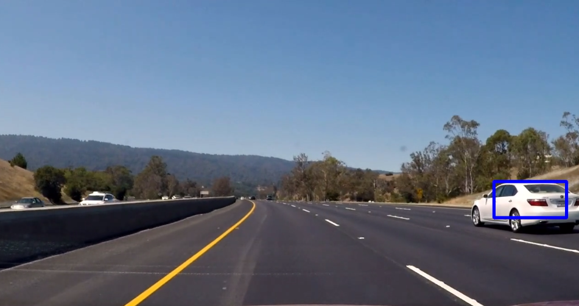
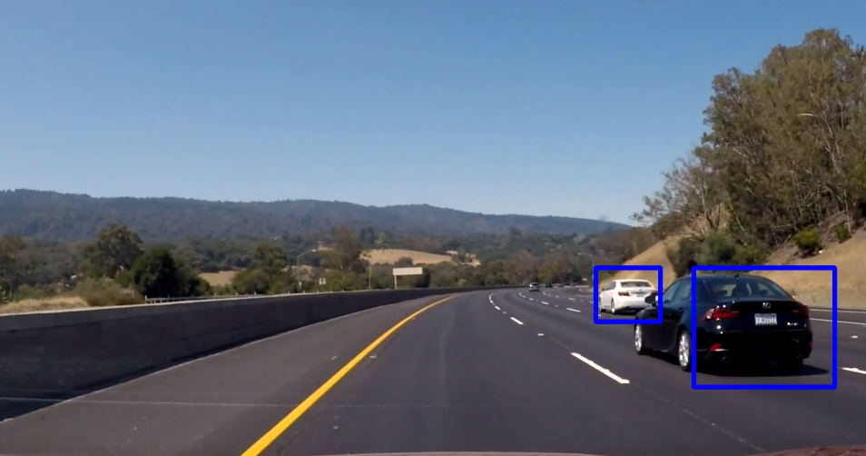
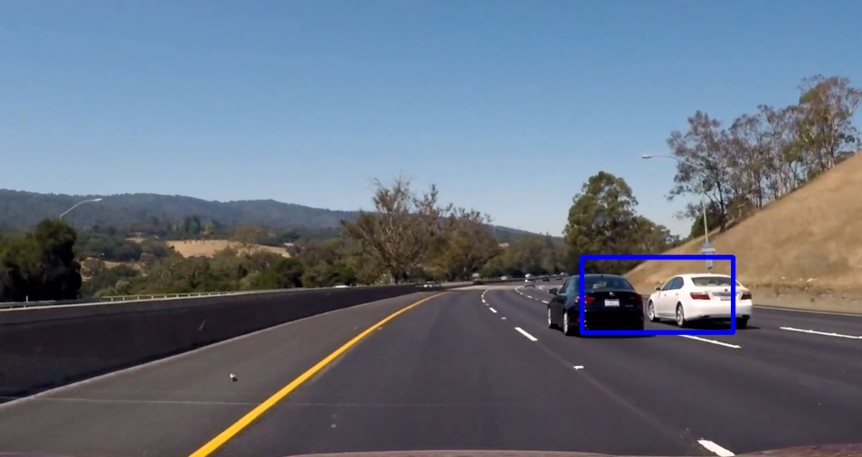
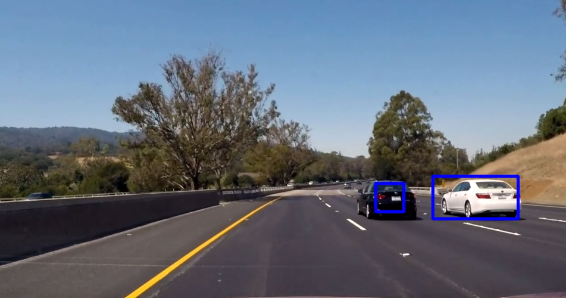

# Self Driving Car Engineer Project 5 - Vehicle Detection & Tracking
## Benjamin Söllner, 25 Jun 2017

[my-discussion]: https://discussions.udacity.com/t/way-too-many-false-positives/302929?u=benkku

---


---

The goals / steps of this project are the following:

* Perform a Histogram of Oriented Gradients (HOG) feature extraction on a labeled training set of images and train a classifier Linear SVM classifier
* Optionally, you can also apply a color transform and append binned color features, as well as histograms of color, to your HOG feature vector.
* Note: for those first two steps don't forget to normalize your features and randomize a selection for training and testing.
* Implement a sliding-window technique and use your trained classifier to search for vehicles in images.
* Run your pipeline on a video stream (start with the test_video.mp4 and later implement on full project_video.mp4) and create a heat map of recurring detections frame by frame to reject outliers and follow detected vehicles.
* Estimate a bounding box for vehicles detected.

## [Rubric](https://review.udacity.com/#!/rubrics/513/view) Points

Here I will consider the rubric points individually and describe how I addressed each point in my implementation.  

### Writeup

**Provide a Writeup / README that includes all the rubric points and how you addressed each one.  You can submit your writeup as markdown or pdf.  [Here](https://github.com/udacity/CarND-Vehicle-Detection/blob/master/writeup_template.md) is a template writeup for this project you can use as a guide and a starting point.**

You're reading it!

### Histogram of Oriented Gradients (HOG)

**1. Explain how (and identify where in your code) you extracted HOG features from the training images.**

For car/notcar templates, the function ```get_hog_features(...)`` in ``src/model.py``` takes care of the hog feature extraction:

```python
def get_hog_features(image, orient, pix_per_cell, cell_per_block, transform_sqrt=False, vis=False, feature_vec=True):
    # [...]
    if vis == True:
        features, hog_image = hog(image, orientations=orient, pixels_per_cell=(pix_per_cell, pix_per_cell),
                                  cells_per_block=(cell_per_block, cell_per_block), transform_sqrt=transform_sqrt,
                                  visualise=True, feature_vector=feature_vec)
        return features, hog_image
    else:
        features = hog(image, orientations=orient, pixels_per_cell=(pix_per_cell, pix_per_cell),
                       cells_per_block=(cell_per_block, cell_per_block), transform_sqrt=transform_sqrt,
                       visualise=False, feature_vector=feature_vec)
        return features
```

For complete images and videos, during slide window search, the hog features are generated separately for blocks so they can be re-used with multiple sliding windows (see ``scan_single_win_size(...)`` in ``src/model.py``):

```python
def scan_single_win_size(image, clf, rescale, hyperparams, box_color=(0,0,1.0), heatmap=None):
    # [...]
    hog_orient = hyperparams['HOG_ORIENT']
    hog_cell_per_block = hyperparams['HOG_CELL_PER_BLOCK']
    hog_pix_per_cell = hyperparams['HOG_PIX_PER_CELL']
    hog_feat = hyperparams['HOG_FEAT']
    hog_channel = hyperparams['HOG_CHANNEL']
    # [...]
    rescaled_image = convert_color(image[y_start:y_stop, :, :], color_space)
    if rescale != 1:
        imshape = image.shape
        rescaled_image = cv2.resize(rescaled_image, (np.int(imshape[1] / rescale), np.int(imshape[0] / rescale)))
    # [...]
    hogs = []
    if hog_feat:
        for channel in range(0, rescaled_image.shape[2]):
            hogs.append(get_hog_features(rescaled_image[:, :, channel],
                        hog_orient, hog_pix_per_cell, hog_cell_per_block, feature_vec=False))
    # [...]
    for x_window in range(n_x_steps):
        for y_window in range(n_y_steps):
            # [...]
            if hog_feat:
                if hog_channel == "ALL":
                    for h in hogs:
                        features.append(h[y_pos:y_pos+blocks_per_window, x_pos:x_pos+blocks_per_window].ravel())
                else:
                    features.append(hogs[hog_channel][y_pos:y_pos+blocks_per_window, x_pos:x_pos+blocks_per_window].ravel())
            # [...]
            test_features = np.hstack(features).reshape(1, -1)
            test_prediction = clf.predict(test_features)
            # [...]
    return draw_image, heatmap
```

Here is a visualization of the hog features of one of the templates:



**2. Explain how you settled on your final choice of HOG parameters.**

The hog parameters are stored in the ``src/hyperparams.py`` file. I increased the number of hog orientations from 9 (used in the lesson) to 11. This gave superior performance. Tuning pixels per cell or cells per block didn't change performance much. I tried out ``sqrt_transform=True`` but that actually worsened performance.

```python
HYPERPARAMS = {
    # [...]
    'HOG_FEAT': True, # Using hog features?
    'HOG_ORIENT': 11, # Number of possible hog cell orientations
    'HOG_PIX_PER_CELL': 8, # Pixels per hog cell
    'HOG_CELL_PER_BLOCK': 2, # Hog cell overlap
    'HOG_CHANNEL': 'ALL', # Which hog channels to use
    'HOG_SQRT': False # use hog's sqrt_transform=True parameter?
    # [...]
}
```

**3. Describe how (and identify where in your code) you trained a classifier using your selected HOG features (and color features if you used them).**

Classification was done with a linear SVM and a feature scaler. The classifier is written to a pickle file for later reuse. See file ``src/model.py``, function ``generate_classifier(...)`` or also ``persist_classifier(...)``, ``restore_classifier(...)`` or ``restore_or_generate_classifier(...)``:

```python
def generate_classifier(templates_path_pattern, hyperparams):
    # [...]
    # Get all paths
    cars, notcars = get_templates(templates_path_pattern)
    # Extract car & non-car features
    car_features = get_features_images(cars, hyperparams)
    notcar_features = get_features_images(notcars, hyperparams)
    # Create an array stack of feature vectors
    X = np.vstack((car_features, notcar_features)).astype(np.float64)
    # Define the labels vector
    y = np.hstack((np.ones(len(car_features)), np.zeros(len(notcar_features))))
    # Split up data into randomized training and test sets
    rand_state = np.random.randint(0, 100)
    X_train, X_test, y_train, y_test = train_test_split(X, y, test_size=0.2, random_state=rand_state)
    # Use a linear SVC
    X_scaler = StandardScaler()
    svc = LinearSVC()
    clf = Pipeline(steps=[('StandardScaler', X_scaler), ('LinearSVC', svc)])
    clf.fit(X_train, y_train)
    return clf, X_test, y_test
```

### Sliding Window Search

**1. Describe how (and identify where in your code) you implemented a sliding window search.  How did you decide what scales to search and how much to overlap windows?**

The sliding window search is performed in the ``scan_single_win_size(...)`` function of ``src/model.py``. It implements a sliding window function of one window size (rescaled up or down with a ``rescale`` factor from a 64x64 image) across a region of interest limited by the ``hyperparam['Y_START']`` and ``hyperparam['Y_STOP']`` values. Overlapping is controlled with ``hyperparam['HOG_CELL_PER_BLOCK']``.

```python
def scan_single_win_size(image, clf, rescale, hyperparams, box_color=(0,0,1.0), heatmap=None):
    # [...]
    # get important hyperparams
    y_start = hyperparams['Y_START']
    y_stop = hyperparams['Y_STOP']
    # [...]
    hog_cell_per_block = hyperparams['HOG_CELL_PER_BLOCK']
    hog_pix_per_cell = hyperparams['HOG_PIX_PER_CELL']
    # [...]
    # image to be analyzed is color-converted to target color space and resized to match
    # appropriately rescaled window size
    rescaled_image = convert_color(image[y_start:y_stop, :, :], color_space)
    if rescale != 1:
        imshape = image.shape
        rescaled_image = cv2.resize(rescaled_image, (np.int(imshape[1] / rescale), np.int(imshape[0] / rescale)))
    # Define number of blocks
    n_x_blocks = (rescaled_image.shape[1] // hog_pix_per_cell) - hog_cell_per_block + 1
    n_y_blocks = (rescaled_image.shape[0] // hog_pix_per_cell) - hog_cell_per_block + 1
    window = 64 # 64 was the orginal sampling rate, with 8 cells and 8 pix per cell
    blocks_per_window = (window // hog_pix_per_cell) - hog_cell_per_block + 1
    cells_per_step = 2  # Instead of overlap, define how many cells to step
    n_x_steps = (n_x_blocks - blocks_per_window) // cells_per_step
    n_y_steps = (n_y_blocks - blocks_per_window) // cells_per_step
    # [...]
    # Go through blocks of image step by step
    for x_window in range(n_x_steps):
        for y_window in range(n_y_steps):
            y_pos = y_window * cells_per_step
            x_pos = x_window * cells_per_step
            x_left = x_pos * hog_pix_per_cell
            y_top = y_pos * hog_pix_per_cell
            sub_image = rescaled_image[y_top:y_top + window, x_left:x_left + window]
            # [...]
    return draw_image, heatmap
```

This function is called multiple times from the ``scan_multiple_win_sizes(...)`` functions in respect to how the re-scaling factors defined in ``HYPERPARAMS`` of ``src/hyperparams.py``:

```python
HYPERPARAMS = {
    # [...]
    'HOG_CELL_PER_BLOCK': 2, # Hog cell overlap
    # [...]
    'Y_START': 350, # Top pixel
    'Y_STOP': 656, # Bottom pixel
    'RESCALES': [1.0] # Scales of windows based on 64x64 window being scale 1.0
    # [...]
}
```

As can be seen from above, we do only use one single rescale factor. Using different rescale values yielded too many false positives. For a discussion of this approach you can also see [this discussion topic started by me][my-discussion].

**2. Show some examples of test images to demonstrate how your pipeline is working.  What did you do to optimize the performance of your classifier?**

Here are some images extracted from the video that show how the pipeline is working:









### Video Implementation

**1. Provide a link to your final video output.  Your pipeline should perform reasonably well on the entire project video (somewhat wobbly or unstable bounding boxes are ok as long as you are identifying the vehicles most of the time with minimal false positives.)**

Below you can see the final video. Here's a [link to my video result](./project_video_output.mp4).

<video width="960" height="540" controls><source src="./project_video_output.mp4"></video>

And here is the final video in "debug mode" (and a [link to it](./project_video_output_debug.mp4). It shows some diagnostic information:
* Top left is the output
* Top right is the heatmap of the current frame
* Bottom right is the aggregated heatmap (already with values lower than threshold set to zero)
* Bottom left are the labels

<video width="960" height="540" controls><source src="./project_video_output_debug.mp4"></video>

**2. Describe how (and identify where in your code) you implemented some kind of filter for false positives and some method for combining overlapping bounding boxes.**

The vehicle detection pipeline detects cars across multiple frames using heatmaps which contain the aggregated confidence values of the SVM that a given pixel is a car - across multiple frames. To compute this aggregated confidence, the heatmap of single frames are stored and memorized across multiple frames in a ``deque`` data structure (see class ``VideoProcessor`` in ``src/model.py``):

```python
class VideoProcessor:
    # [...]

    def __init__(self, clf, hyperparams, box_color=None):
        # [...]
        self.heatmap_deque = deque(maxlen=hyperparams["HEAT_FRAMES"])

    def process_image(self, image, debug=False):
        # [...]
        # Get old heatmap from internal deque representation or initialize with zeros if unknown
        old_heatmap = np.zeros(image.shape[0:2]) if len(self.heatmap_deque) == 0 else sum(self.heatmap_deque)
        # [...]
        _, draw_image, labels_heatmap, new_heatmap, agg_heatmap = find_cars_image(modified_image, self.clf,
                                self.hyperparams, self.box_color, old_heatmap=old_heatmap)
        # [...]

    # [...]
```

The ``find_cars_image(...)`` function (in ``src/model.py``) then thresholds this aggregated heatmap (``old_heatmap+new_heatmap``):

```python
def find_cars_image(image, clf, hyperparams, box_color=None, old_heatmap=None):
    # [...]
    _, heatmap = scan_multiple_win_sizes(image, clf, hyperparams, box_colors=None)
    # Build an aggregated heatmap of this heatmap and the old heatmap
    agg_heatmap = old_heatmap+heatmap if old_heatmap is not None else heatmap
    # Apply threshold to find cars
    thresh_heatmap = apply_threshold(agg_heatmap, heat_threshold)
    # [...]
```

The thresholds are controled by the ``HYPERPARAMS`` in ``src/hyperparams.py``:

```python
HYPERPARAMS = {
    # [...]
    'HEAT_THRESHOLD': 5.0, # Threshold to reject false positives
    'HEAT_FRAMES': 40 # Over how many frames to collect heat
}
```

Again, these values were carefully chosen. See [my discussion on the Udacity Forum][my-discussion].

### Discussion

**Briefly discuss any problems / issues you faced in your implementation of this project.  Where will your pipeline likely fail?  What could you do to make it more robust?**

The pipeline currently is optimized for eliminating false positives. This was a tricky process for me since initially, the pipeline did show way too many false positives. I needed to remove the differently scaled window sizes and just work with a scaling factor of 1.0. Here are some ideas on how to re-introduce other scaling factors without creating more false positives, therefore hopefully adding some more true poisitives:
* The SVM could be tweaked with its ``C``-parameter or a non-linear SVM kernel could be implemented
* Another form of heatmap combination could be used. Currently, all sliding window scales are saved to the same heatmap. We could use different heatmaps for different sliding window sizes.
* More data could be added, either with hard negative mining (adding wrongly identified false positives to the test set as noncar-images) or by using the [Udacity-own vehicle data](https://github.com/udacity/self-driving-car/tree/master/annotations)

## Files Submitted

My project includes the following files:

* [``writeup_report.md``](writeup_report.md) / [``.html``](writeup_report.html): the writeup of this project including the showcase images (you are reading it)
* [``project_video_output.mp4``](project_video_output.mp4): the output video with bounding boxes for cars identified
* [``project_video_output_debug.mp4``](project_video_output_debug.mp4): the output video with diagnostic information
* [``test_video_output.mp4``](project_video_output.mp4): the short test video with bounding boxes for cars identified
* [``test_video_output_debug.mp4``](project_video_output_debug.mp4): the short test video with diagnostic information
* [``src/model.py``](src/model.py): the code / algorithm to perform vehicle detection / tracking
* [``src/tests.py``](src/tests.py): boilerplate functions to test the model code and view the output with matplotlib
* [``src/hyperparams.py``](src/hyperparams.py): the hyperparameters for the algorithm
* [``CarND 05 Vehicle Detection and Tracking.ipynb``](CarND%2005%20Vehicle%20Detection%20and%20Tracking.ipynb) / [``.html```](CarND%2005%20Vehicle%20Detection%20and%20Tracking.html): a (rendered) iPython notebook that contains the output of all tests
* [``tester.py``](tester.py): a command line tool to test the code without python notebooks
